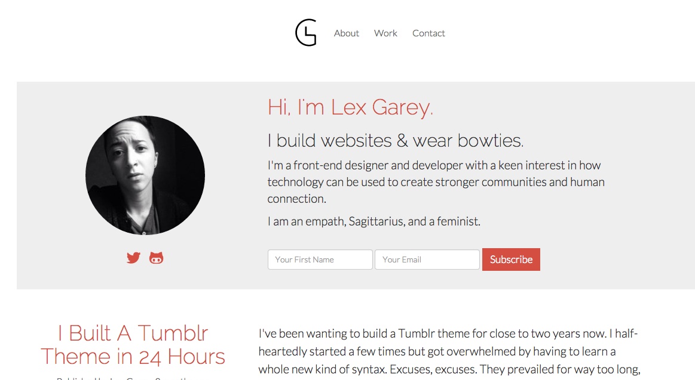

##  Distinct Theme for Ghost

A minimal theme for Ghost. Heavy handcoded stuff in here due to Ghost's minimal feature set, but should be easy enough to change.

### Features

 - Skeleton based on [Starter.ghost][1] by [theaqua][2]
 - Uses Twitter Bootstrap 3, SASS, Grunt, & Bower
 - Custom logo available using Ghost

### Installation & Stuff
 - Clone this repository to `/content/themes`: ``git clone https://github.com/lexgarey/Distinct.git`` 
 - In Ghost's settings change "Theme" preference, restart Ghost (otherwise it won't reflect your new theme)
 - Go to ``/content/themes/Distinct``, make ``npm install && bower install``
 - Run ``grunt serve`` (for live compiling ``.scss`` files and concat ``.js`` files) or ``grunt`` for build
 

  [1]: https://github.com/theaqua/Starter.ghost
  [2]: https://github.com/theaqua/